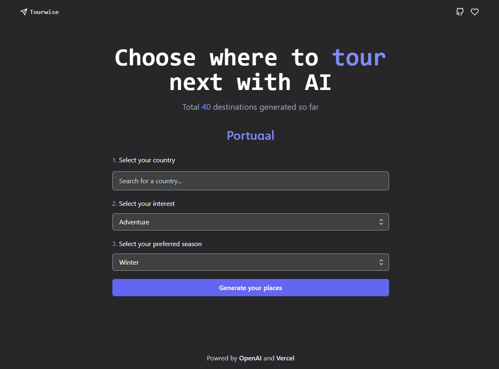

# [Tourwise](https://tourwise.vercel.app/)

This project generates social media bios using AI. It is bootstrapped with the [T3 Stack](https://create.t3.gg/).

[](https://tourwise.vercel.app/)

## Tech Stack

- [Next.js](https://nextjs.org)
- [Prisma](https://prisma.io)
- [Tailwind CSS](https://tailwindcss.com)
- [tRPC](https://trpc.io)
- [OpenAI GPT-3 API](https://platform.openai.com/overview)

## Features

- Generate places to travel based on user preferences
- Save generated places to the database after clicking on the heart icon
- Display saved places with the number of likes

## Installation

### 1. Clone the repository

```bash
git clone https://github.com/sadmann7/tourwise.git
```

### 2. Install dependencies

```bash
yarn install
```

### 3. Create a `.env` file

Create a `.env` file in the root directory and add the environment variables as shown in the `.env.example` file. You can get the OpenAI API key from [here](https://beta.openai.com/account/api-keys).

### 4. Run the application

```bash
yarn run dev
```

The application will be available at `http://localhost:3000`.

## Deployment

Follow the deployment guides for [Vercel](https://create.t3.gg/en/deployment/vercel), [Netlify](https://create.t3.gg/en/deployment/netlify) and [Docker](https://create.t3.gg/en/deployment/docker) for more information.
